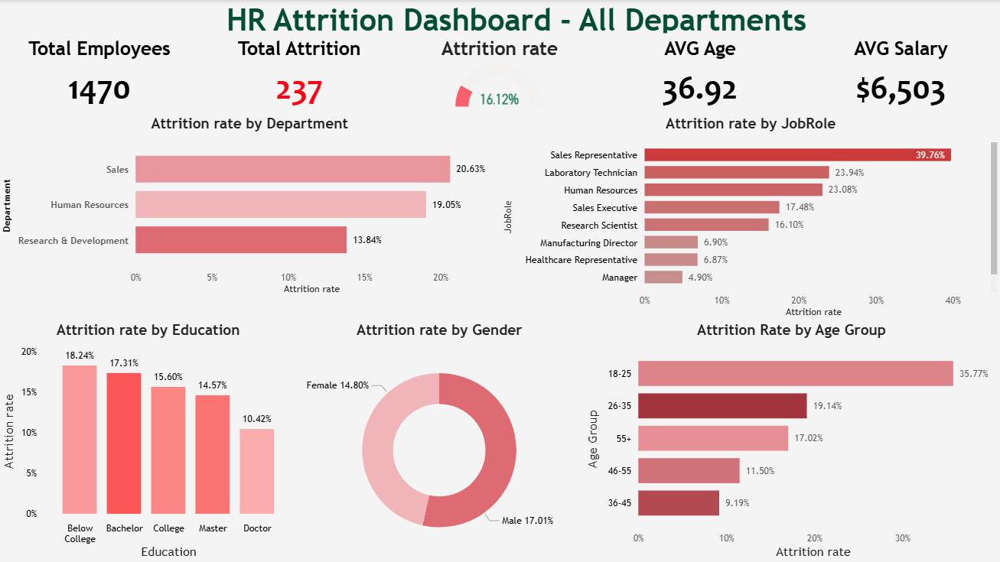
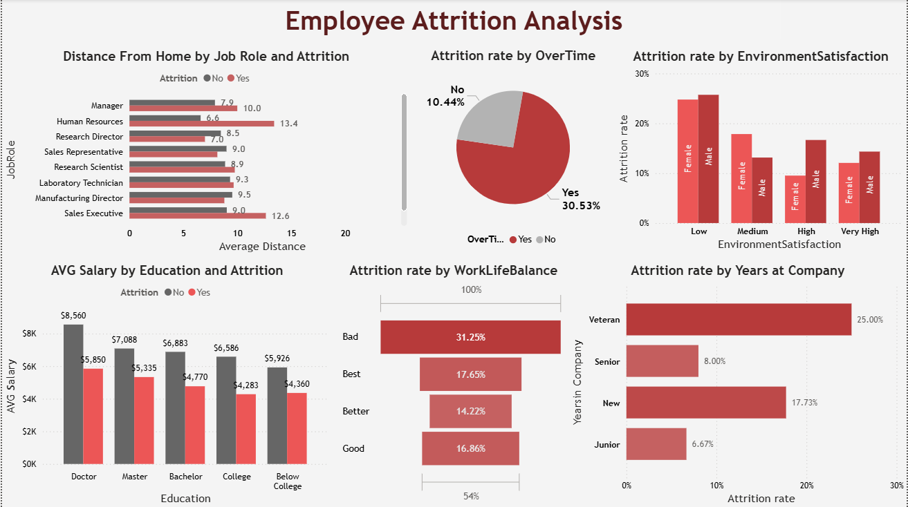
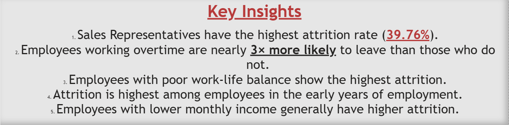

# 📊 HR Attrition Dashboard


An interactive Power BI dashboard built using the IBM HR Analytics Employee Attrition dataset to identify the key factors that contribute to employee turnover and support HR decision-making.

---

# 📌 Project Overview

Employee attrition is a major challenge for organizations. This dashboard analyzes HR data to uncover patterns related to employee turnover, helping decision-makers understand why employees leave the company.

The dashboard provides both high-level KPIs and detailed analysis across departments, job roles, education levels, work-life balance, overtime, and other important HR factors.

---

# 🎯 Objectives

- Analyze employee attrition across different business dimensions.
- Identify the departments and job roles with the highest attrition.
- Explore the relationship between overtime and employee turnover.
- Compare salary, education level, and attrition.
- Discover the impact of work-life balance and environment satisfaction.
- Provide actionable business insights for HR teams.

---

# 🛠️ Tools & Technologies

- Power BI Desktop
- Power Query
- DAX
- Data Modeling
- Data Visualization

---

# 📂 Dataset

**IBM HR Analytics Employee Attrition Dataset**

This is a fictional HR dataset created by IBM Data Scientists for learning and analytics purposes.

Dataset includes information about:

- Employee Demographics
- Salary
- Department
- Job Role
- Education
- Distance From Home
- Overtime
- Environment Satisfaction
- Work-Life Balance
- Job Satisfaction
- Years at Company
- Attrition

---

# 📊 Dashboard Pages

## 1️⃣ HR Attrition Dashboard

Provides an executive overview including:

- Total Employees
- Total Attrition
- Attrition Rate
- Average Employee Age
- Average Salary
- Attrition Rate by Department
- Attrition Rate by Job Role
- Attrition Rate by Education
- Attrition Rate by Gender
- Attrition Rate by Age Group

---

## 2️⃣ Employee Attrition Analysis

Provides deeper analysis including:

- Distance From Home by Job Role & Attrition
- Average Salary by Education & Attrition
- Attrition Rate by OverTime
- Attrition Rate by Environment Satisfaction
- Attrition Rate by Work-Life Balance
- Attrition Rate by Years at Company

---

## 3️⃣ Key Insights

Business insights extracted from the analysis.

---

# 📈 KPIs

| KPI | Description |
|------|-------------|
| Total Employees | Total number of employees |
| Total Attrition | Employees who left the company |
| Attrition Rate | Percentage of employees who left |
| Average Age | Average employee age |
| Average Salary | Average monthly salary |

---

# 🔍 Key Insights

- Sales Representatives have the highest attrition rate (39.76%).
- Employees working overtime are nearly **3× more likely** to leave than those who do not.
- Poor work-life balance is strongly associated with higher attrition.
- Employees in the early years of employment are more likely to leave.
- Employees with lower monthly income generally experience higher attrition.
- Sales department has the highest attrition among all departments.
- Younger employees tend to leave more frequently than older employees.

---

# 💡 Skills Demonstrated

- Data Cleaning
- Data Transformation
- Power Query
- DAX Measures
- KPI Design
- Dashboard Design
- Interactive Reporting
- Business Analysis
- HR Analytics
- Data Visualization

---

# 📷 Dashboard Preview

## HR Attrition Dashboard


---

## Employee Attrition Analysis



---

## Key Insights



---

# 📁 Repository Structure

```
HR-Attrition-Dashboard/
│
├── HR-Attrition-Dashboard.pbix
├── README.md
├── Dashboard.png
├── Analysis.png
├── Insights.png
└── HR-Employee-Attrition.csv
```

---

# 👤 Author

**Abanoub Emad**

- Data Analyst
- Skilled in Power BI, SQL, Excel, and DAX

GitHub:
https://github.com/abanoubemad1622-boop

---

# ⭐ If you found this project useful, consider giving it a star!
